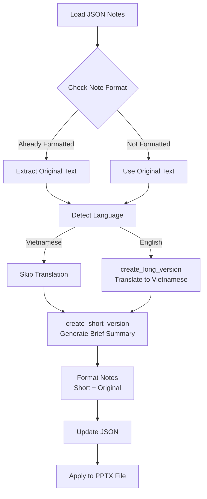

# Revise update_notes_format.py to use Azure Foundry Models Response AP

I

## Overview

Replace OpenAI client with Azure Foundry Models Response API to translate English notes to Vietnamese and generate short versions. Automatically update PPTX file after processing.

## Architecture

## Implementation Steps

### 1. Update Dependencies and Imports

- Remove `openai` import
- Add `azure.identity.DefaultAzureCredential` and `azure.ai.projects.AIProjectClient`
- Update environment variable handling for `AZURE_AI_PROJECT_ENDPOINT` and `MODEL_DEPLOYMENT_NAME`

### 2. Create Azure Foundry Client Initialization

- Function: `create_foundry_client(endpoint: str, deployment_name: str) -> OpenAI client`
- Use `DefaultAzureCredential()` for authentication
- Create `AIProjectClient` with endpoint
- Return OpenAI client via `project_client.get_openai_client()`
- Handle authentication errors gracefully

### 3. Implement Language Detection

- Function: `detect_language(text: str) -> str`
- Use existing `is_vietnamese()` function to detect Vietnamese
- Return "vietnamese" or "english" based on detection
- Handle edge cases (empty text, mixed content)

### 4. Create Long Version Function

- Function: `create_long_version(original_text: str, output_language: str = "vietnamese", client, deployment_name: str) -> str`
- **Logic:**
- If `output_language == "vietnamese"` and text is already Vietnamese → return original (skip)
- If text is English → call Response API to translate to Vietnamese
- If text is Vietnamese and output is English → translate to English
- **Prompt:** "Translate the following speaker notes to Vietnamese. Maintain the conversational, speakable tone suitable for a live presentation. Address the audience as 'anh/chị' and use 'chúng ta' when referring to shared actions."
- Use `client.responses.create(model=deployment_name, input=prompt)` 
- Handle retries and errors (max 3 retries with exponential backoff)
- Return translated text or original on failure

### 5. Create Short Version Function

- Function: `create_short_version(original_text: str, output_language: str = "vietnamese", client, deployment_name: str) -> str`
- **Prompt:** "Create a concise summary of the following speaker notes. Requirements: 30-50% of original length, preserve key points, maintain conversational tone, use complete sentences. Output language: {output_language}. Address audience as 'anh/chị' if Vietnamese."
- Use Response API with same retry logic
- Return brief summary

### 6. Update Format Notes Function

- Function: `format_notes(original_text: str, client, deployment_name: str, output_language: str = "vietnamese") -> str`
- Extract original if already formatted (check for "- Original:" or "- original:")
- Call `create_long_version()` to get translated/verified long version
- Call `create_short_version()` to get brief version
- Format as: `"- Short version:\n{short}\n\n- Original:\n{long}"`
- Handle empty notes (return empty string)

### 7. Update Main Processing Function

- Function: `process_json_file(input_path, output_path, pptx_path=None, endpoint=None, deployment_name=None, output_language="vietnamese")`
- Initialize Azure Foundry client using environment variables or parameters
- Process all slides with notes (skip empty)
- Extract original text if already formatted
- Call `format_notes()` for each slide
- Write updated JSON
- **If `pptx_path` provided:** Call `pptx_notes.py apply` command to update PPTX file automatically

### 8. Update Command Line Arguments

- Remove `--api-key` and `--model` arguments
- Add `--pptx` argument for PPTX file path (optional)
- Add `--output-language` argument (default: "vietnamese")
- Add `--endpoint` and `--deployment-name` arguments (optional, use env vars if not provided)
- Add `--in-place` flag for PPTX update (default: use zip engine)

### 9. Add PPTX Update Integration

- After processing JSON, if `pptx_path` is provided:
- Call `apply_notes_zip_in_place()` or use subprocess to run `pptx_notes.py apply`
- Use `--engine zip` by default (safest)
- Handle errors gracefully

## Files to Modify

1. **[scripts/update_notes_format.py](scripts/update_notes_format.py)**

- Replace OpenAI client with Azure Foundry client
- Add `create_long_version()` function
- Add `create_short_version()` function  
- Update `format_notes()` to use new functions
- Update `process_json_file()` to handle PPTX updates
- Update CLI arguments

2. **[requirements.txt](requirements.txt)**

- Verify `azure-identity` and `azure-ai-projects>=2.0.0b1` are present
- Remove `openai` if not needed elsewhere

## Error Handling

- Authentication failures: Clear error message about Azure credentials